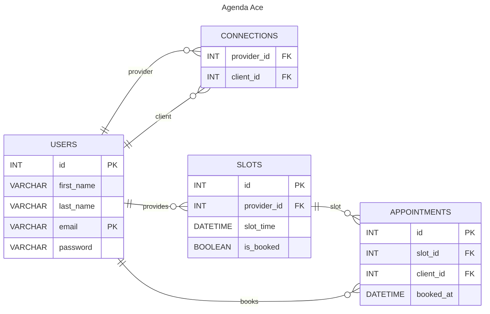

# Design Document

By Milos Djakovic

Video overview: https://youtu.be/wqCPmlMZjOk

## Scope

This database is designed to support a flexible scheduling platform where users can act as both clients and providers. Relationships between users are defined through directional connections, allowing one user to book services from another while also offering services. For example, a user might book a session with a fitness trainer and later offer tutoring services to the same trainer.

The database enables users to register, connect with others, publish available time slots, view others' availability, and book appointments. It includes stored procedures for booking appointments and deleting users to ensure data consistency and simplify operations.

The database does not support recurring availability templates, group sessions, or direct messaging.

## Functional Requirements

The database supports the following key actions:

* Registering users by adding their details to the `users` table.
* Establishing connections between users by inserting records into the `connections` table, defining provider-client relationships.
* Creating available time slots by adding entries to the `slots` table.
* Booking appointments by associating a client with a slot in the `appointments` table using a stored procedure.
* Deleting users and their associated data through a stored procedure.

These actions are implemented through direct interactions with the database schema and stored procedures, ensuring data consistency and integrity.

## Representation

### Entities

The database defines four main entities:

1. `users`: People using the platform, whether as providers, clients, or both. Each user has a unique ID, first name, last name, email address, and password. Emails are enforced as unique identifiers. The password field supports authentication and user management features.
2. `connections`: Defines a directional link from a provider to a client. This allows flexible modeling where two users can be mutually connected as provider and client in opposite directions.
3. `slots`: Time slots created by providers. Each slot is tied to a provider and can be booked by one client. Slots track their time and whether they are already booked.
4. `appointments`: Represents a confirmed booking by a client into a slot. It references both the slot and the client and includes a timestamp for when the booking occurred.

Each data type and constraint was chosen to reinforce consistent and valid data:

* `INT UNSIGNED` ensures positive values suitable for primary keys and foreign key references.
* `DATETIME` accurately represents exact times for slots and bookings.
* `BOOLEAN`, such as `is_booked`, simplifies availability checks, although it must be managed carefully to avoid inconsistencies.
* `CHECK` constraints, such as those preventing self-connections, help preserve logical relationships.

The `slot_id` in `appointments` is marked as `UNIQUE`, meaning each slot can have only one appointment. This design explicitly prevents double-bookings. If the system were extended to support group sessions, this constraint would be removed or replaced by a different design.

Slot duration is intentionally not represented in the schema. Providers are expected to design their availability accordingly, spacing their slots as needed. For example, if a provider needs 20 minutes per appointment and 10 minutes of buffer, they would manually create slots every 30 minutes.

### Relationships

The `connections` table links users to each other, representing a provider-client relationship. A provider can have many clients and vice versa, but each link is unidirectional. This design was chosen to support maximum flexibility. For instance, one user may be a graphic designer and a client of a software developer, who in turn is also their client.

The `slots` table captures the availability that providers offer. The `appointments` table associates one client with one slot, forming the actual booking. Together, these relationships allow for queries from either the provider's or client's point of view.

The ER diagram below illustrates these relationships:

## Optimizations

To improve performance and usability, several optimizations have been added:

* Indexes on fields such as `email`, `slot_time`, `provider_id`, and `client_id` to support efficient searching, filtering, and joining.
* The `is_booked` flag in the `slots` table allows checking availability without joining the `appointments` table. While this introduces some risk of data becoming inconsistent, it can drastically improve performance on large datasets.
* Views like `provider_appointments`, `client_appointments`, `client_providers`, and `provider_clients` simplify frequent queries. These are used for listing upcoming or past appointments and for exploring the network of providers and clients.

If the system gains popularity and scales to thousands of users and appointments, the write-heavy tables like slots and appointments may face insertion bottlenecks due to the overhead introduced by maintaining multiple indexes. While indexes significantly improve the performance of read-heavy queries, especially those filtering by time or user, they do add cost to each insert or update operation.

## Limitations

The project has no support for:

* Recurring appointment schedules or availability templates. Each slot must be manually created.
* Restricting certain slots to specific clients. All clients connected to a provider can view all their available slots.
* Appointment cancellation or rescheduling. Clients must book a new slot, and providers must manually adjust or delete prior bookings.
* Messaging between clients and providers to coordinate changes or cancellations.
* Group appointments. The schema does not allow multiple clients per slot.
* Soft deletions and version history of changes, such as cancellations or reschedules.
* Analyzing metrics, such as the most active users or the average time between booking and appointment.

Nonetheless, the design fulfills the core goals of a lightweight scheduling system that balances simplicity with essential functionality. It is suitable for professionals who value ease of use over exhaustive feature sets.
